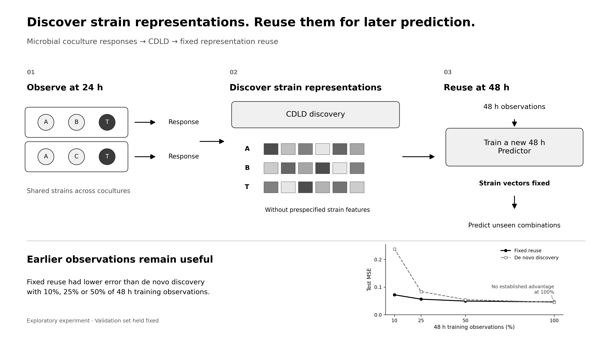

# Discovering strain latent traits for microbial coculture prediction

Discover strain-specific representations from 24 h coculture responses and reuse them with a separate 48 h Predictor. No prespecified strain features are required as model inputs.



CDLD discovers strain representations from 24 h coculture responses. These representations are held fixed while a new Predictor is trained on 48 h observations. In the exploratory training-data reduction experiment, fixed reuse had lower error than de novo discovery at 10%, 25% and 50%; an advantage was not established at 100%.

## Reproduce from upstream data

This repository contains the code and notebooks for reproducing the study. Raw data, prepared CSV/NPZ files, model checkpoints, selection records, predictions, logs and other rendered figures are generated locally and are not distributed here. The graphical abstract above is included for the repository overview.

Use Python 3.12 on macOS for the training workflow:

```bash
python -m venv .venv
source .venv/bin/activate
python -m pip install -r requirements.txt
jupyter notebook
```

Run the notebooks in this order:

1. [00_Prepare_Data.ipynb](00_Prepare_Data.ipynb): fetch hash-verified upstream files, reconstruct the pilot and full-data splits, measured effects and nested 48 h subsets, and validate the inputs.
2. [01_Mac_Training.ipynb](01_Mac_Training.ipynb): train discovery and prediction models, choose models using validation data and evaluate training-data fractions.
3. [03_Mac_Full_Data_Evaluation.ipynb](03_Mac_Full_Data_Evaluation.ipynb): evaluate trained models on the primary and alternative splits.

Notebook 02 is not required. The training and evaluation notebooks include saved execution results. Model training is configured for macOS CPUs with four concurrent jobs. It may require substantial time and disk space. [runtime.json](runtime.json) specifies the recorded environment for the reported experiments.

For data preparation alone, only NumPy and pandas are needed:

```bash
python -m pip install numpy pandas
python prepare_data.py
python validate_inputs.py
```

No model training occurs in these two commands. For custom locations, use `python prepare_data.py --output-root PATH --raw-dir CACHE` and `python validate_inputs.py --root PATH`.

## Data source and deterministic preparation

Original data: Baichman-Kass, Song and Friedman, *Competitive interactions between culturable bacteria are highly non-additive*, eLife 12:e83398 (2023), [doi:10.7554/eLife.83398](https://doi.org/10.7554/eLife.83398).

Upstream: [amichaibk/community_effects](https://github.com/amichaibk/community_effects/tree/7a2e0a97ea26fd0eb26d0611ccbce57b2962b213), commit `7a2e0a97ea26fd0eb26d0611ccbce57b2962b213`. [The source manifest](preprocessing/source_manifest.json) fixes the paths and SHA256 hashes of the 17 input files. Downloads are verified before use.

[PREPROCESSING.md](PREPROCESSING.md) specifies filtering, identifier harmonization, sorting, seeds, pilot coverage moves, full-data coverage moves and nested subset construction. The workflow regenerates split files from upstream data rather than loading stored split assignments.

## Source layout

- `prepare_data.py`, `preprocessing/`: acquisition and input reconstruction.
- `validate_inputs.py`: expected counts, split separation, coverage and nesting checks.
- `full/primary/`, `full/robust/`: model code and configuration.
- `full/baselines.py`, `full/evaluate.py`: comparison-model selection and evaluation.
- `fractions/`: reduced-training-data model code and configuration.
- `verify_saved_predictions.py`: verify numerical results after local training/evaluation.
- `graphical_abstract/generate_graphical_abstract.py`: generate the monochrome graphical abstract from locally computed results.

`LF` denotes fixed reuse, `LU` reuse followed by CDLD discovery on 48 h observations, and `RU` de novo discovery on 48 h observations. Each strategy uses a separate Predictor fitted to its resulting fixed strain representations.

## Interpretation

The training-data reduction experiment is exploratory and holds the validation set fixed. Cluster-bootstrap intervals are conditional on fitted models and concern the observed affecting-strain combinations. New-strain, batch and environment generalization and total experimental cost reduction were not evaluated.

Dohyoung Rim · [ORCID 0000-0003-2022-6333](https://orcid.org/0000-0003-2022-6333)
